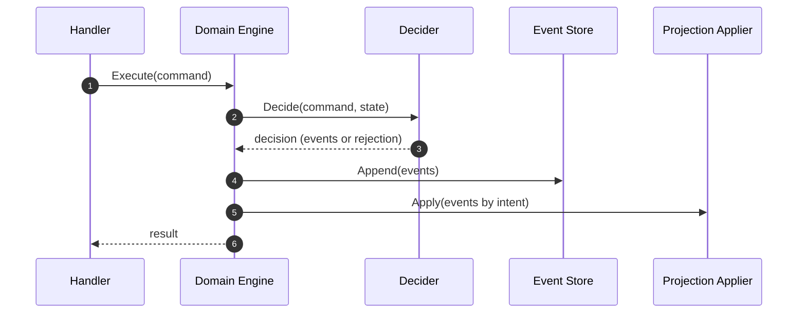

# Event-Driven System

Concise architecture contract for game-domain write paths.

## Purpose

The game service is event-sourced:

- commands express intent
- deciders produce decisions
- accepted decisions emit immutable events
- projections are derived by applying events in sequence order

The event journal is authoritative. Projection state is derived and rebuildable.

## Core lifecycle

`request -> command -> decider -> event append -> projection apply`

Required outcomes:

1. Mutations are represented by emitted events, not direct projection writes.
2. Rejected commands emit no domain mutation event.
3. Projection state can be reconstructed from the event journal.

## Write-path sequence

## Non-negotiable invariants

1. Event append is the source of truth for accepted mutations.
2. Request handlers must not write projection stores directly.
3. Core command paths must not emit system-owned event types.
4. System command paths must not emit core-owned event types.
5. System-owned envelopes must carry `system_id` and `system_version`.
6. Event payloads must remain replay-safe and deterministic.
7. Replay and projection behavior must be explicit through event intent.

## Event intent model

Every event definition declares intent:

- `IntentProjectionAndReplay`: fold + project (default for most events)
- `IntentReplayOnly`: fold only, no projection write
- `IntentAuditOnly`: journal-only, neither fold nor projection

Intent defines required handlers and startup validation obligations.

## Registration and validation contract

Startup validation must fail fast when contracts are inconsistent.

Minimum guarantees:

- every replay-relevant event has fold coverage
- every projection-relevant event has adapter coverage
- audit-only events do not accumulate dead fold handlers
- unknown system module/adapter routing is treated as a startup or replay error

## System extension rules

When adding mechanics or systems:

1. Register command and event definitions in the owning module.
2. Keep command/event ownership boundaries explicit (`core` vs `sys.<system_id>.*`).
3. Route all mutating paths through shared execute-and-apply orchestration.
4. Add fold and adapter coverage for new projection/replay intents.
5. Update generated catalogs in `docs/events/`.

## Deep references

Use these pages for detailed mechanics and troubleshooting:

- [Event system reference](../../reference/event-system-reference.md)
- [Event replay architecture](event-replay.md)
- [Event contracts catalog](../../events/index.md)
- [System extension architecture](../systems/game-systems.md)
