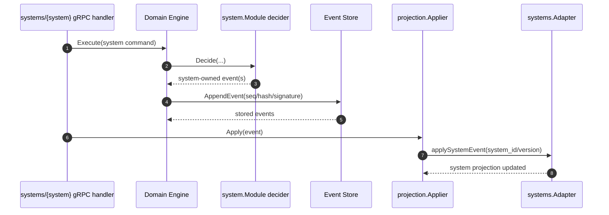

# Game Systems Architecture

```
quick-start-system-developer.md  (first 30 minutes)
  -> event-driven-system.md      (write-path invariants)
  -> game-systems.md             (you are here — implementation checklist)
     -> daggerheart-event-timeline-contract.md  (mechanic mappings)
```

This document explains how a game system extends the shared event-driven core.
For the command-to-event-to-projection lifecycle, read
[Event-driven system](event-driven-system.md) first.
For the high-level design checklist, see [systems checklist](systems.md).
For exact runtime-registered command/event contracts, use generated docs in
[`docs/events/`](../events/index.md).

## Design goals

Fracturing.Space keeps core campaign/session behavior system-agnostic while
allowing each ruleset to own its mechanics.

Benefits:

1. Shared infrastructure for campaigns, participants, sessions, and event
   journaling.
2. System-specific mechanics without polluting core domain packages.
3. Predictable replay and projection behavior across all systems.
4. Independent evolution of systems by version (`system_id + system_version`).

## Ownership boundaries

System support is built on ownership rules:

- Core-owned commands/events: campaign/session/participant/invite/character
  lifecycle.
- System-owned commands/events: mechanics and state transitions specific to a
  game system.

Invariants:

- Core must not emit system-owned events.
- Systems must not emit core-owned events.
- System-owned envelopes must include both `system_id` and `system_version`.
- System-owned type names must match the system namespace:
  `sys.<system_id>.*`.
- Core treats system payloads as opaque and routes them to system handlers.

## Event intent selection

Every event definition must declare an `Intent`. For the full decision tree
and semantics, see [Event-driven system: Event](event-driven-system.md#event).

Summary: most system events use `IntentProjectionAndReplay`. Use
`IntentReplayOnly` for fold-only state. Use `IntentAuditOnly` for
journal-only observability records.

Startup validators enforce consistency:
- `ValidateSystemFoldCoverage`: every `ProjectionAndReplay`/`ReplayOnly` event
  has a fold handler.
- `ValidateAdapterEventCoverage`: every `ProjectionAndReplay` event has an
  adapter handler.
- `ValidateNoFoldHandlersForAuditOnlyEvents`: no fold handler exists for
  `AuditOnly` events (dead code guard).

## Runtime extension surfaces

There are two extension surfaces with different responsibilities.

### Domain module registry (write-path routing)

Location: `internal/services/game/domain/module/registry.go`

Used by the domain engine to:

- register system-owned command and event definitions
- route system commands to module deciders
- route system events to module folders during replay/fold
- optionally enforce system-specific character session-start readiness

Module interface:

```go
type Module interface {
    ID() string
    Version() string
    RegisterCommands(registry *command.Registry) error
    RegisterEvents(registry *event.Registry) error
    EmittableEventTypes() []event.Type
    Decider() Decider
    Folder() Folder
    StateFactory() StateFactory
}

// Optional extension implemented by modules that need system-specific
// character readiness validation before session start.
type CharacterReadinessChecker interface {
    CharacterReady(systemProfile map[string]any) (ready bool, reason string)
}

`CharacterReadinessChecker` is evaluated after core session-start readiness
checks pass. Core readiness handles participant/controller invariants; this
optional hook lets systems enforce profile completeness or similar mechanics
requirements without leaking system rules into core packages. Startup validation
requires every registered system module to implement this interface.
```

### System bridge and projection adapters

Locations:

- `internal/services/game/domain/bridge/registry_bridge.go`
- `internal/services/game/domain/bridge/adapter_registry.go`

Used for:

- exposing game-system metadata through API surfaces
- applying system-owned events into system-specific projection tables

Projection adapter interface:

```go
type Adapter interface {
    ID() string
    Version() string
    Apply(context.Context, event.Event) error
    Snapshot(context.Context, string) (any, error)
    HandledTypes() []event.Type
}
```

## Registry map

Three registries serve different purposes. All are populated from a single
`SystemDescriptor` entry in `manifest/manifest.go`.

```
SystemDescriptor (manifest/manifest.go)
├── BuildModule()         → module.Registry      (write-path routing)
│   ├── RegisterCommands  → command.Registry      (shared with core)
│   ├── RegisterEvents    → event.Registry        (shared with core)
│   ├── Decider()         → command decisions
│   └── Folder()          → aggregate fold / replay
│
├── BuildMetadataSystem() → bridge.MetadataRegistry      (API metadata bridge)
│   └── Maps system_id + version to protobuf enum for transport layers
│
└── BuildAdapter()        → bridge.AdapterRegistry (read-path projections)
    └── Applies system events to denormalized projection tables
```

- **`module.Registry`** (`domain/module/registry.go`): Routes system commands to
  deciders and system events to folders. Used by the domain engine write-path
  and the replay pipeline.
- **`bridge.MetadataRegistry`** (`domain/bridge/registry_bridge.go`): Maps
  `system_id` + `system_version` to protobuf `GameSystem` enums. Used by gRPC
  and MCP transport layers to expose system metadata.
- **`bridge.AdapterRegistry`** (`domain/bridge/adapter_registry.go`): Routes
  system-owned events to projection adapters that write to system-specific read
  tables. Used by `projection.Applier.applySystemEvent`.

When adding a new system, register all three surfaces from one
`SystemDescriptor` so they stay aligned.

### Package naming rationale

| Package | Why this name |
|---------|---------------|
| `domain/module` | Each game system is a "module" plugged into the engine |
| `domain/bridge` | Bridges between domain events and read-model stores / API metadata |
| `domain/bridge/manifest` | System descriptors that manifest (wire) all three registries |
| `domain/bridge/{system}` | Game system implementation; lives under bridge because systems implement both write-path and projection interfaces |

### StateFactory vs StateHandlerFactory: two interfaces, different layers

The codebase has two state factory interfaces that serve different layers:

| Interface | Package | Returns | Used by |
|---|---|---|---|
| `module.StateFactory` | `domain/module` | `(any, error)` | Write-path aggregate fold / replay |
| `bridge.StateHandlerFactory` | `domain/bridge` | Typed handlers (`CharacterStateHandler`, `SnapshotStateHandler`) | API bridge (gRPC/MCP transport) |

New systems typically implement only the `module.StateFactory` variant. The
`bridge.StateHandlerFactory` is satisfied by the metadata/registry system
implementation (e.g. `DaggerheartRegistrySystem`) which wraps domain state
behind the resource/damage abstractions the API layer needs.

## Where systems plug in

Core registration entrypoint:

- `internal/services/game/domain/engine/registries.go`

Server wiring entrypoints:

- domain module registration: `internal/services/game/app/domain.go`
- projection adapter registration: `internal/services/game/api/grpc/game/system_adapters.go`

## Adding a new system (current flow)

### 1. Orient from the manifest (start here)

> **Start here.** `manifest.go` is the single source of truth for system
> registration. Open it first when onboarding — it shows all three registry
> surfaces (`BuildModule`, `BuildMetadataSystem`, `BuildAdapter`) wired from
> one `SystemDescriptor`, and serves as a map of what exists.

Add or verify your system's `SystemDescriptor` entry in
`internal/services/game/domain/bridge/manifest/manifest.go` so `Modules()`,
`MetadataSystems()`, and `AdapterRegistry(...)` stay aligned.

### 2. Add identity and versioning

- Add enum values in `api/proto/common/v1/game_system.proto`.
- Run `make proto`.
- Define stable `SystemID` and `SystemVersion` constants in your module package.

### 3. Implement a domain module

Create `internal/services/game/domain/bridge/{system}/module.go` that
implements `system.Module`.

Responsibilities:

- register system-owned command definitions
- register system-owned event definitions
- provide decider/folder/state-factory implementations

#### Infrastructure helpers for system authors

The `module` package provides typed helpers that eliminate boilerplate in
deciders, folders, and adapters. New system authors should use these
instead of writing raw switch/unmarshal code:

- **`module.FoldRouter[S]`** with **`module.HandleFold[S, P]`**: typed fold
  dispatch by event type. Auto-unmarshals payloads into `P`, calls a typed
  handler `func(S, P) error`. Eliminates the per-case unmarshal switch in
  `Fold`. See `daggerheart/folder.go` for usage.

- **`module.AdapterRouter`** with **`module.HandleAdapter[P]`**: typed adapter
  dispatch by event type. Auto-unmarshals payloads, calls a typed handler
  `func(context.Context, event.Event, P) error`. Eliminates unmarshal
  boilerplate in projection adapters. See `daggerheart/adapter.go` for usage.

- **`module.DecideFunc[P]`** / **`module.DecideFuncWithState[S, P]`**: typed
  decider helpers for the common case where one command type maps to one event
  type with the same payload. Handles unmarshal, validation, and event
  construction.

- **`module.DecideFuncTransform[S, PIn, POut]`**: like `DecideFuncWithState`
  but for cases where the emitted event payload type (`POut`) differs from the
  command payload type (`PIn`). Adds a `transform` function to convert between
  them. See `daggerheart/decider.go` for GM fear, hope spend, and stress spend
  cases.

#### DecideFunc decision tree

Use this tree to pick the right helper for a new command handler:

```
Does your command need aggregate snapshot state?
  NO  ─→ Does command payload == event payload?
           YES → DecideFunc[P]                    (e.g. decideLoadoutSwap)
           NO  → Raw Decide switch                (e.g. decideRestTake, multi-event)
  YES ─→ Does event payload differ from command payload?
           YES → DecideFuncTransform[S, PIn, POut] (e.g. decideHopeSpend)
           NO  → DecideFuncWithState[S, P]          (e.g. decideCharacterStatePatch)
```

- **`DecideFunc[P]`**: simplest path — one command type, one event type, same
  payload, no state needed. Just unmarshal, validate, emit.
- **`DecideFuncWithState[S, P]`**: same as above but receives snapshot state
  for idempotency/validation checks (e.g. rejecting no-op mutations).
- **`DecideFuncTransform[S, PIn, POut]`**: command payload and event payload
  are different types. Adds a `transform` function to convert between them
  (e.g. `HopeSpendPayload` → `CharacterStatePatchedPayload`).
- **Raw `Decide` switch**: when one command emits multiple events or needs
  custom routing logic that helpers can't express (e.g. `rest.take` emits both
  `rest_taken` and optionally `countdown_updated`).

#### System state lifecycle

When the aggregate folder encounters the first event for a given
`(system_id, system_version)` pair, it calls `StateFactory.NewSnapshotState`
to seed the initial system state. All subsequent events for the same key
fold into that state. System authors don't need to manually initialize
state — the aggregate folder handles lazy creation.

`NewSnapshotState` must be deterministic: given the same `campaign_id`, it
must return the same initial state, because replay depends on this guarantee.

### 4. Define payload contracts and validation

- Add payload structs for command/event types.
- Validate payload shape and invariants in registry validators.
- Keep validation deterministic and replay-safe.

### 5. Wire into engine startup

Pass your module to `engine.BuildRegistries(...)` in
`internal/services/game/app/domain.go`.

### 6. Implement system projection adapter

Create `internal/services/game/domain/bridge/{system}/adapter.go` implementing
`systems.Adapter`, then register it in
`internal/services/game/api/grpc/game/system_adapters.go`.

#### When to implement ProfileAdapter

If your system stores per-character data inside `system_profile` (the
system-specific section of a character profile), implement `bridge.ProfileAdapter`
on your projection adapter. The projection applier calls `ApplyProfile` when a
`character.profile_updated` event arrives, passing the system-specific profile
data for your system ID.

```go
type ProfileAdapter interface {
    ApplyProfile(ctx context.Context, campaignID, characterID string, profileData json.RawMessage) error
}
```

Implement this when your system needs to:
- denormalize character profile fields into system-specific projection tables
- keep system state in sync with profile updates (e.g. class, level, traits)

The full dispatch path for profile updates:

```
character.profile_updated event
  → projection/applier.go: Apply()
    → projection/apply_character.go: applyCharacterProfileUpdated()
      → iterates SystemProfile map entries
        → for each (system_id, profile_data):
          → bridge.AdapterRegistry.Get(system_id, version)
            → casts adapter to bridge.ProfileAdapter
              → adapter.ApplyProfile(ctx, campaignID, characterID, profileData)
```

This means your adapter receives only its own system's profile data — the
projection applier handles routing. You never need to filter by system ID
inside `ApplyProfile`.

### 7. Add storage schema and queries

- Add migrations in `internal/services/game/storage/sqlite/migrations/`.
- Add query definitions in `internal/services/game/storage/sqlite/queries/`.
- Extend storage interfaces and conversion helpers.

### 8. Add transport/API handlers

- gRPC endpoints: `internal/services/game/api/grpc/systems/{system}/`.
- MCP mappings (if needed): `internal/services/mcp/`.

### 9. Verify through tests

- Unit tests for decider/folder/validators.
- Projection tests for adapter/store behavior.
- Integration tests across gRPC/MCP + storage.

### 10. Confirm system extension contract (required in reviews)

- All emitted system events are registered with explicit intent (`projection_and_replay`
  vs `audit_only`) so projection obligations are discoverable from registries.
- Core decider outputs have a test that new events can be round-tripped through
  `BuildRegistries` and replayed once in folder tests.
- Core applier and adapter coverage tests prove every `projection_and_replay` event
  is handled (or intentionally ignored by intent).
- Command builders and payload validators reject malformed envelopes with clear
  errors.
- New system event types are documented in both:
  - command/event runtime registrations
  - generated event docs in `docs/events/` (`command-catalog.md`,
    `event-catalog.md`, `usage-map.md`).
- New code path is exercised with at least one happy-path and one rejection/edge-case
  test for each new command and event pairing.

This checklist should be part of review for each new game-system module.

### Runtime execution diagram



## Daggerheart reference implementation

Use Daggerheart as the baseline for structure and naming.

| Concern | Location |
|---|---|
| Module wiring | `internal/services/game/domain/bridge/daggerheart/module.go` |
| Command decisions | `internal/services/game/domain/bridge/daggerheart/decider.go` |
| Replay folder (Fold method) | `internal/services/game/domain/bridge/daggerheart/folder.go` |
| Projection adapter | `internal/services/game/domain/bridge/daggerheart/adapter.go` |
| Event type constants | `internal/services/game/domain/bridge/daggerheart/event_types.go` |
| Payload contracts | `internal/services/game/domain/bridge/daggerheart/payload.go` |
| gRPC system handlers | `internal/services/game/api/grpc/systems/daggerheart/` |

## Consistency expectations for system authors

1. Module deciders and folders must be deterministic.
2. System events must be replay-safe and self-describing through payload + metadata.
3. Projection adapter behavior must be idempotent under replay.
4. Domain writes must happen through commands/events only, never direct projection mutation.
5. **Event payloads must record absolute values, not deltas** (see below).
6. **Prefer `DecideFuncMulti` for multi-consequence atomicity** — when one
   mechanic produces multiple events, emit them from a single command decision
   via batch append rather than executing sequential commands. See
   [Daggerheart timeline contract](daggerheart-event-timeline-contract.md#design-principle-prefer-decidefuncmulti-for-multi-consequence-atomicity)
   for the full rationale and pattern.

### Invariant: absolute values in event payloads

Event payloads must record the resulting state (`hp_after: 8`), not the change
(`hp_delta: -3`). This is a top-level system invariant, not a suggestion.

**Why**: Replay applies every event in the journal to rebuild projection state.
A delta-based payload (`+3 HP`) applied twice during replay produces the wrong
result (`+6 HP`). An absolute-value payload (`HP is now 8`) is inherently
idempotent — applying it any number of times converges to the same state.

**Where it applies**: every `Apply()` adapter method and every `Fold()` handler
that writes to state.

**Pattern**:
```go
// WRONG — delta-based, breaks on replay
payload := DamagePayload{HPDelta: -3}

// RIGHT — absolute values, replay-safe
payload := DamagePayload{HPBefore: 8, HPAfter: 5}
```

**Enforcement**:
- `testkit.ValidateSystemConformance` includes a fold idempotency check (G3)
  that folds each event type twice into fresh state and asserts identical
  results.
- Adapter idempotency tests (see "Idempotency testing" section) catch delta
  patterns in projection writes.

### Rejection code naming convention

Command deciders return `Rejection{Code, Message}` when a command is declined.
The `Code` is a stable string for API consumers; the `Message` is human-readable
for diagnostics.

**Format**: `SCREAMING_SNAKE_CASE` with a domain prefix.

| Scope | Prefix | Example |
|-------|--------|---------|
| Core domain | `<DOMAIN>_` | `CAMPAIGN_NAME_EMPTY`, `SESSION_NOT_STARTED` |
| System-specific | `<SUBDOMAIN>_` | `GM_FEAR_OUT_OF_RANGE`, `COUNTDOWN_BEFORE_MISMATCH` |
| Shared (cross-domain) | No prefix | `PAYLOAD_DECODE_FAILED`, `COMMAND_TYPE_UNSUPPORTED` |

**Shared codes**: `PAYLOAD_DECODE_FAILED` and `COMMAND_TYPE_UNSUPPORTED` are
exported from `domain/command` as `command.RejectionCodePayloadDecodeFailed`
and `command.RejectionCodeCommandTypeUnsupported`. Use these constants instead
of inline string literals.

**Suffix conventions**:

| Suffix | Meaning | Example |
|--------|---------|---------|
| `_REQUIRED` | A required field is missing | `SESSION_ID_REQUIRED` |
| `_EMPTY` | A string field is blank | `CAMPAIGN_NAME_EMPTY` |
| `_INVALID` | A field value is outside valid range | `CAMPAIGN_INVALID_GM_MODE` |
| `_ALREADY_EXISTS` | Duplicate creation attempt | `CAMPAIGN_ALREADY_EXISTS` |
| `_NOT_CREATED` | Operation on a non-existent entity | `CHARACTER_NOT_CREATED` |
| `_NO_MUTATION` | Command produces no state change | `CONDITION_CHANGE_NO_MUTATION` |
| `_MISMATCH` | Optimistic concurrency check failed | `COUNTDOWN_BEFORE_MISMATCH` |

**Rules for new codes**:

1. Use `SCREAMING_SNAKE_CASE`.
2. Start with the domain noun (`CAMPAIGN_`, `SESSION_`, `CHARACTER_`, etc.).
3. End with a reason suffix from the table above when one fits.
4. Keep codes short and predictable for API consumers and i18n mapping.
5. Define codes as package-level constants, not inline strings.

## Event timeline contract requirement (for every new mechanic)

Before implementing a new mechanic, define its timeline contract:

`request -> command -> emitted event(s) -> projection targets -> apply mode -> invariants`

Required process:

1. Add or update a timeline row in the system contract doc before code changes.
2. Ensure handler code uses shared execute-and-apply orchestration.
3. Ensure system-owned side effects are emitted via explicit `sys.*` commands,
   not embedded as system-owned effects in core command payloads.
4. Add/update guard tests that prevent bypass patterns.

For Daggerheart, use:
[Daggerheart Event Timeline Contract](daggerheart-event-timeline-contract.md).

Bypass patterns that are not allowed in request handlers:

1. Direct event append APIs from handler code.
2. Direct projection/store mutation for mutating domain outcomes.
3. Local duplicated execute/reject/apply loops instead of shared orchestration helpers.

### Clarification gate pattern

When a mechanic's command/event contract is ambiguous, add a clarification
gate instead of implementing speculatively:

1. Add or update a timeline row with `TBD` command/event types.
2. List specific questions that must be resolved.
3. State the provisional boundary (what to do until resolved).
4. Do not implement until the gate is resolved in docs.

## Projection replay safety

System adapters apply events into denormalized projection tables. Several
adapter handlers read existing projection state before writing (e.g. reading
a current value to compute a delta). This is safe because:

1. **Ordered replay**: Events replay in strict sequence order, so the
   read-then-write chain reproduces the same final state deterministically.
2. **Full replay recovers from corruption**: If projection state becomes
   inconsistent, a full replay from the journal rebuilds it from scratch.

Rules for adapter authors:

- **Do not cache state across `Apply` calls.** Each call must read fresh
  projection state. Stale in-memory caches can diverge during replay.
- **Handle `storage.ErrNotFound` gracefully.** During replay the projection
  table may be empty. Seed defaults when a record does not exist yet.
- **Projection adapter behavior must be idempotent under replay.** The same
  event sequence must produce the same projection state regardless of how many
  times it is replayed.
- **Never write projection records outside of adapter `Apply`.** All
  projection mutations for system events must flow through the adapter
  dispatch path so replay remains the single source of truth.

## Idempotency testing for system adapters

System adapter `Apply()` methods must be idempotent: replaying the same event
sequence must produce identical projection state regardless of how many times
it runs. The most common mistake is an adapter that increments a counter or
appends to a list instead of setting an absolute value.

### Test pattern

Use this pattern to verify idempotency for each adapter handler:

```go
func TestAdapter_Apply_Idempotent(t *testing.T) {
    ctx := context.Background()
    store := newFakeStore()
    adapter := NewAdapter(store)

    evt := event.Event{
        CampaignID:    "camp-1",
        Seq:           1,
        Type:          EventTypeMyAction,
        SystemID:      SystemID,
        SystemVersion: SystemVersion,
        EntityType:    "character",
        EntityID:      "char-1",
        PayloadJSON:   []byte(`{"hp_after": 5}`),
    }

    // First apply.
    if err := adapter.Apply(ctx, evt); err != nil {
        t.Fatalf("first apply: %v", err)
    }
    stateAfterFirst := store.Get(ctx, "camp-1", "char-1")

    // Second apply of the same event.
    if err := adapter.Apply(ctx, evt); err != nil {
        t.Fatalf("second apply: %v", err)
    }
    stateAfterSecond := store.Get(ctx, "camp-1", "char-1")

    if !reflect.DeepEqual(stateAfterFirst, stateAfterSecond) {
        t.Fatalf("adapter is not idempotent:\n  first:  %+v\n  second: %+v",
            stateAfterFirst, stateAfterSecond)
    }
}
```

Key points:

- Apply the same event twice (not two different events).
- Compare projection state after each apply using `reflect.DeepEqual`.
- Use absolute values in payloads (e.g. `hp_after`) rather than deltas to
  make idempotency natural.
- See the Daggerheart adapter tests for working examples.

## Common pitfalls

### 1. Forgetting RegisterEvents after adding to EmittableEventTypes

**Symptom**: Startup panic or "unknown event type" error from the event
registry validator.

**Root cause**: `EmittableEventTypes()` declares the type for validation, but
the event registry never learns the type's metadata (payload schema, intent).

**Fix**: Add a corresponding `registry.Register(...)` call inside
`RegisterEvents()` for every type returned by `EmittableEventTypes()`.

**Caught by**: `engine.ValidateSystemFoldCoverage` / startup registry check.

### 2. Using IntentReplayOnly for an event that needs projection writes

**Symptom**: Event appends successfully and fold state updates, but the
projection table is never written. No error is raised.

**Root cause**: `IntentReplayOnly` tells the projection applier to skip adapter
dispatch for this event type. The event only folds into aggregate state.

**Fix**: Change the event intent to `IntentProjectionAndReplay` so the
projection applier dispatches to your adapter.

**Caught by**: Manual inspection or `ValidateAdapterEventCoverage` (if the
adapter declares a handler for a replay-only type, the validator flags the
mismatch).

### 3. Delta-based payloads instead of absolute values

See the top-level invariant in "Consistency expectations" →
"Invariant: absolute values in event payloads" for the full rationale, pattern,
and enforcement mechanisms.

**Caught by**: Fold idempotency (G3) and adapter idempotency tests.

### 4. Direct projection mutation from request handlers

**Symptom**: Projection state updates immediately but is lost on replay.
Journal does not contain any record of the change.

**Root cause**: Handler code writes directly to a projection store (e.g.
`store.PutCharacterState(...)`) instead of emitting a command that produces
an event that the adapter applies.

**Fix**: Emit a command, let the decider produce an event, and let the
projection adapter write the store.

**Caught by**: Code review. No automated validator catches this because the
write succeeds at runtime. The only signal is that replay produces different
state than the live system.

### 5. Missing ProjectionStores field when adding a system store

**Symptom**: `AdapterRegistry(...)` in `manifest.go` compiles, but
`BuildAdapter` receives a nil store and returns a nil adapter. The adapter
is silently skipped during registration.

**Root cause**: `manifest.ProjectionStores` lacks a field for the new system's
store. The `BuildAdapter` closure guard returns nil for nil stores by
convention, so no error is raised.

**Fix**: Add the new store field to `ProjectionStores` in `manifest.go` and
pass it through `BuildAdapter`. Update `Stores.Validate()` if the store is
required.

**Caught by**: `validateSystemRegistrationParity` at startup (adapter missing
for a registered module).

## Related docs

- Event lifecycle and consistency model: [Event-driven system](event-driven-system.md)
- Replay/checkpoint operations: [Event replay](event-replay.md)
- High-level system design checklist: [Systems checklist](systems.md)
