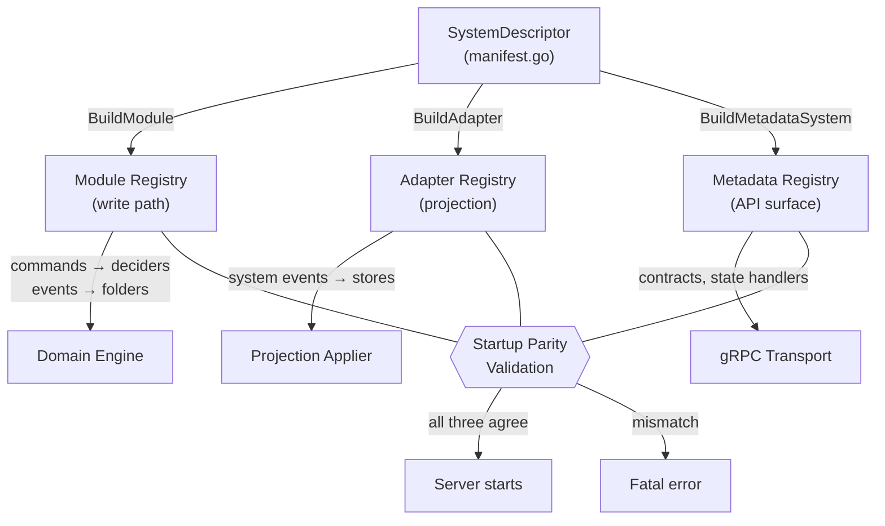

# Game Systems Architecture

Canonical architecture for extending Fracturing.Space with a game system.

## Reading order

1. [Adding a command/event/system](../../guides/adding-command-event-system.md) (how-to)
2. [Event-driven system](../foundations/event-driven-system.md) (write-path invariants)
3. This page (architecture boundaries and extension surfaces)
4. Daggerheart references:
   - [Daggerheart creation workflow](../../reference/daggerheart-creation-workflow.md)
   - [Daggerheart event timeline contract](../../reference/daggerheart-event-timeline-contract.md)

## Purpose

Core campaign/session infrastructure stays system-agnostic while each ruleset owns
its mechanics.
This separation allows:

- deterministic replay and projection behavior
- independent system evolution by `system_id + system_version`
- clear ownership of command/event definitions

## Ownership boundaries

- **Core-owned commands/events**: campaign/session/participant/invite/character lifecycle.
- **System-owned commands/events**: mechanics specific to a game system.

Non-negotiable invariants:

1. Core must not emit system-owned events.
2. Systems must not emit core-owned events.
3. System-owned envelopes must include `system_id` and `system_version`.
4. System-owned types must use `sys.<system_id>.*` naming.
5. Request handlers must mutate through commands/events only.

## Event intent policy

Every event must declare an intent. Most system events should use projection + replay
intent. Audit-only events must stay journal-only.

Startup validation enforces coverage:

- fold coverage for replay-relevant events
- adapter coverage for projection-relevant events
- no fold handlers for audit-only events

## Extension surfaces and registry wiring

Adding a game system requires four registries, all wired from one
`SystemDescriptor` in `domain/bridge/manifest/manifest.go`. If a system is
present in one registry and missing in another, startup validation fails.

| Registry | Scope | File | What it provides |
|----------|-------|------|------------------|
| **Module** | Write path | `domain/module/registry.go` | Routes commands to deciders, events to folders during replay |
| **Adapter** | Projection | `domain/bridge/adapter_registry.go` | Applies system events to projection stores |
| **Metadata** | API surface | `domain/bridge/registry_bridge.go` | Transport-facing contracts, state handler factories, outcome appliers |
| **Manifest** | Glue | `domain/bridge/manifest/manifest.go` | Single descriptor that wires the other three together |

Metadata registry contracts are domain-owned (`SystemID`, metadata status enums).
gRPC/API adapters map those values to protobuf enums at transport boundaries so
domain packages remain independent from generated API code.

### Startup validation order

`BuildRegistries()` in `domain/engine/registries_builder.go`:

1. **Register core domains** — core commands, events, and aliases.
2. **Register system modules** — run module-scoped registration pipeline (`register commands`, `register events`, `validate type namespace`, `validate emittable events`).
3. **Validate write-path contracts** — fold, decider, state factory, and readiness coverage.
4. **Validate projection contracts** — handler coverage, no stale handlers, adapter events.
5. **Three-way parity check** — module, metadata, and adapter registries must agree on which systems exist.

### Common startup failures

| Mistake | Error |
|---------|-------|
| Event not handled by folder | `system emittable events missing folder fold handlers: <types>` |
| Command not in decider | `system commands missing decider handlers: <types>` |
| Adapter missing for event | `system emittable events missing adapter handlers: <types>` |
| Module without metadata | `metadata missing for module <id>@<version>` |
| Metadata without adapter | `adapter missing for metadata <id>@<version>` |
| `HasProfileSupport=true` without `ProfileAdapter` | `system module registry mismatch: <validation error>` |
| Non-deterministic state factory | `state factory determinism check failed for <id>` |
| Fold handler for audit-only event | `fold handlers registered for audit-only events (dead code): <types>` |

## Package layout contract

Reference layout for a system implementation:

- `internal/services/game/domain/bridge/<system>/module.go` (registration)
- `.../decider.go` (command decisions)
- `.../folder.go` (replay fold)
- `.../adapter.go` (projection apply)
- `.../event_types.go` and `.../payload.go` (contracts)

Keep handlers thin and avoid transport logic in domain packages.

## Authoring invariants

- Deciders and folders must be deterministic.
- Adapter `Apply` behavior must be idempotent under replay.
- Event payloads should capture resulting state (absolute values), not deltas.
- Rejection codes should be stable, machine-readable constants.
- Multi-consequence mechanics should prefer single-command atomic emission patterns.

## Minimum review checklist

1. Command and event registrations are explicit and tested.
2. Replay fold and projection adapter coverage exists for new event types.
3. Mutating paths use shared command execution orchestration.
4. Generated event catalogs are updated (`docs/events/`).
5. At least one happy-path and one rejection-path test exists per new command/event pair.

## Related docs

- [Event-driven system](../foundations/event-driven-system.md)
- [Adding a command/event/system](../../guides/adding-command-event-system.md)
- [Events index](../../events/index.md)
