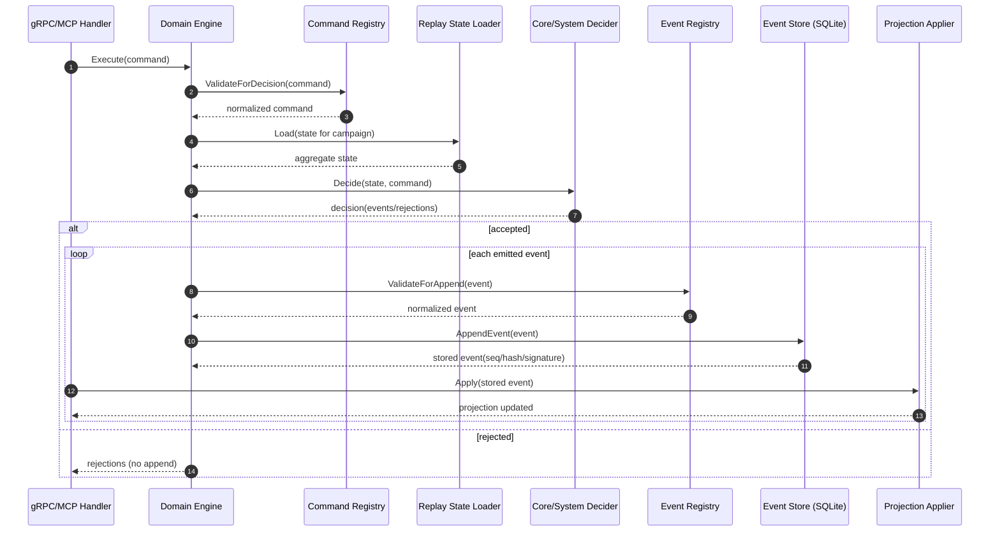
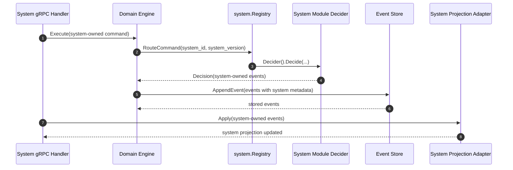

# Event-Driven System

This document is the canonical guide to how game-domain writes work.
If you are new to the codebase, read this before changing command handlers,
event payloads, or projection code.

## Why this model exists

The game service is event-sourced:

- Commands express **intent**.
- Deciders produce **decisions**.
- Accepted decisions emit immutable **events**.
- Projections are rebuilt by **applying events in order**.

The event journal is authoritative. Projection rows are derived and can be
recomputed from events.

## Core concepts

### Command

Command envelope type: `internal/services/game/domain/command/registry.go`.

A command is a request to attempt a state change. Commands are validated before
decision logic runs.

Important command fields:

- `campaign_id`: required scope for all commands.
- `type`: required command type string (for example `campaign.create`).
- `actor_type` and `actor_id`: who initiated it.
- `session_id`: optional session scope.
- `request_id` and `invocation_id`: traceability through transport layers.
- `entity_type` and `entity_id`: target entity hints for handlers/folds.
- `system_id` and `system_version`: required only for system-owned commands.
- `correlation_id` and `causation_id`: optional causal linkage.
- `payload_json`: canonicalized JSON payload.

### Event

Event envelope type: `internal/services/game/domain/event/registry.go`.

An event is an immutable fact that was accepted by the domain. Event storage
assigns sequencing and integrity fields.

Event definitions now include intent to make projection behavior explicit:

- `IntentProjectionAndReplay`: event must be handled in replay/projection paths.
- `IntentAuditOnly`: event is not projected and is treated as audit/observability
  only.

The intent is configured on `event.Definition` as `Intent`, defaults to
`IntentProjectionAndReplay` when omitted.

Important event fields:

- `campaign_id`: required scope.
- `type`: required event type string (for example `participant.joined`).
- `timestamp`: occurrence time.
- `actor_type` and `actor_id`: origin identity.
- `session_id`, `request_id`, `invocation_id`: traceability.
- `entity_type` and `entity_id`: affected entity.
- `system_id` and `system_version`: required for system-owned events.
- `correlation_id` and `causation_id`: causal linkage.
- `payload_json`: canonicalized JSON payload.

Storage-assigned event fields:

- `seq`: per-campaign monotonic sequence.
- `hash`: event content hash.
- `prev_hash`: previous event chain hash.
- `chain_hash`: chained hash including previous link.
- `signature` and `signature_key_id`: HMAC integrity signature data.

### Decision

Decision type: `internal/services/game/domain/command/decision.go`.

A decision is the output of command handling:

- `events`: accepted facts to append.
- `rejections`: domain reasons why intent was declined.

Commands may emit zero, one, or multiple events.

### Projection

Projection applier: `internal/services/game/projection/applier_domain.go`.

Projections are query models derived from events. They are not source-of-truth.
If projections diverge, replay from events repairs them.

## End-to-end write flow

Primary runtime wiring:

- `internal/services/game/app/domain.go`
- `internal/services/game/domain/engine/handler.go`
- `internal/services/game/storage/sqlite/store.go`
- `internal/services/game/projection/applier_domain.go`

Flow:

1. API/application layer constructs a `command.Command` and calls domain engine `Execute`.
2. `command.Registry.ValidateForDecision` normalizes and validates envelope + payload.
3. Optional gate policy runs (`engine.DecisionGate`) for session-gated commands.
4. Current aggregate state is replay-loaded (`engine.ReplayStateLoader`).
5. Decider returns `command.Decision` (events and/or rejections).
6. `event.Registry.ValidateForAppend` validates each emitted event.
7. Event store appends each event and assigns `seq/hash/chain/signature`.
8. Application layer applies emitted events to projection stores.
9. Replay checkpoints and command-replay snapshots are advanced as events are processed.

### Write-path sequence diagram



### Worked example: participant join

Command (intent):

```json
{
  "campaign_id": "camp_123",
  "type": "participant.join",
  "actor_type": "system",
  "entity_type": "participant",
  "entity_id": "part_456",
  "payload_json": {
    "participant_id": "part_456",
    "display_name": "Rowan",
    "role": "PLAYER",
    "controller": "HUMAN",
    "campaign_access": "EDIT"
  }
}
```

Event (accepted fact, storage fields assigned on append):

```json
{
  "campaign_id": "camp_123",
  "seq": 42,
  "type": "participant.joined",
  "entity_type": "participant",
  "entity_id": "part_456",
  "hash": "<event_hash>",
  "prev_hash": "<previous_chain_hash>",
  "chain_hash": "<chain_hash>",
  "signature_key_id": "<key_id>",
  "signature": "<hmac_signature>"
}
```

## Registration model

Registry assembly is centralized in:

- `internal/services/game/domain/engine/registries.go`

Core packages register their definitions:

- `campaign.RegisterCommands` / `campaign.RegisterEvents`
- `session.RegisterCommands` / `session.RegisterEvents`
- `participant`, `invite`, `character`, `action` equivalents

Each definition includes:

- `type`
- `owner` (`core` or `system`)
- `validate_payload` callback
- optional gate policy (`command.GatePolicy`)

System modules register via `BuildRegistries(modules...)` and are expected to
register their own system-owned command/event types.

Recommended module registration contract:

- Register all emitted command types with payload validation.
- Register all emitted system event types with the same intent you want downstream
  consumers to enforce.
- Use `IntentProjectionAndReplay` for events that must impact projection state.
- Use `IntentAuditOnly` only when intentional by design (for example, internal
  counters or outbox/telemetry-only events).

## Validation rules and why they matter

Command and event registries enforce:

- Type must be registered before use.
- Envelope metadata is trimmed and normalized.
- Payload must be valid JSON and canonicalized.
- Actor constraints:
  - participant/GM actor types require `actor_id`.
- Ownership constraints:
  - core-owned entries must not include `system_id/system_version`.
  - system-owned entries must include both metadata fields and explicit
    addressing (`entity_type` + `entity_id`).

This makes payload hashing stable, routing deterministic, and replay behavior
reproducible.

## Event naming and addressing conventions

Use these conventions when adding new command/event types so routing and replay
remain predictable across systems.

Naming:

- Core command types: `<domain>.<entity>.<verb>` (for example `session.gate.open`).
- Core event types: `<domain>.<entity>_<verb_past>` (for example `session.gate_opened`).
- System-owned command/event types should be system-scoped for new work:
  - command: `sys.<system_id>.<domain>.<verb>`
  - event: `sys.<system_id>.<domain>.<verb_past>`
- Keep versioning in `system_version`, not in the type string.

Addressing:

- Every mutating event should set `entity_type`.
- Every mutating event with a concrete target should set `entity_id`.
- Runtime validation currently enforces `entity_type` + `entity_id` for all
  system-owned events.
- `campaign_id + seq` is the authoritative identity for stored events.
- `request_id`, `invocation_id`, `correlation_id`, and `causation_id` are for
  traceability and causal linking, not identity.

Why this matters:

- Reduces naming collisions as more systems are added.
- Makes filters (`type`, `entity_type`, `entity_id`, `system_id`) easier to use.
- Avoids timeline/projection fallbacks that infer meaning from partial envelopes.

## Trigger semantics

In this codebase, "triggering an event" means a decider accepted a command and
emitted one or more events in its decision.

Rules of thumb:

- Commands do not mutate projections directly.
- Rejections do not append events.
- Side effects should happen from accepted events, not before append.
- Mutating runtime handlers should write through `Domain.Execute`; direct
  `AppendEvent` usage is reserved for maintenance/import workflows.

There is a compatibility append path in `EventService.AppendEvent`
(`internal/services/game/api/grpc/game/event_application.go`) that maps a small
subset of event types to domain commands; the domain path remains the source of
truth when enabled and should remain the canonical write route.

## Projections and consistency

Core projection dispatch:

- `projection.Applier.Apply` handles core event types by switch on `evt.Type`.
- System-owned events are routed through `system_id` to a system adapter
  (`projection.applySystemEvent`).

System projection adapter surface:

- `internal/services/game/domain/systems/adapter_registry.go`
- Daggerheart example: `internal/services/game/domain/systems/daggerheart/adapter.go`

Consistency model:

- Event append is authoritative.
- Projection writes are derived from emitted events.
- Replay can rebuild projections when needed (`projection/replay.go` and
  `domain/replay/replay.go`).

## Integrity and tamper resistance

Event journal integrity implementation:

- Hashing: `internal/services/game/storage/integrity/event_hash.go`
- Append + signatures: `internal/services/game/storage/sqlite/store.go` (`AppendEvent`)
- Verification: `internal/services/game/storage/sqlite/store.go` (`VerifyEventIntegrity`)

Guarantees:

- Per-campaign strict sequence ordering.
- Hash-chain linkage (`prev_hash` + `chain_hash`).
- HMAC signatures over chain hashes.
- Verification path to detect tampering or corruption.

## Replay, checkpoints, and recovery

Replay APIs:

- Domain replay runner: `internal/services/game/domain/replay/replay.go`
- Projection replay helper: `internal/services/game/projection/replay.go`

Checkpoint behavior:

- Replay starts from the max of stored checkpoint and requested `after_seq`.
- Each successful apply saves a new checkpoint.
- Sequence gaps stop replay with an error.
- Unregistered system-owned events stop replay with an error (no silent ignore).

Operationally: if projection writes fail after events are appended, replay is
the recovery mechanism.

### Consistency and recovery timeline

```mermaid
sequenceDiagram
    autonumber
    participant ENG as Domain Engine
    participant ES as Event Store
    participant PR as Projection Applier
    participant RP as Replay Runner

    ENG->>ES: append accepted event
    ES-->>ENG: event committed
    ENG->>PR: apply event to projections
    alt projection apply fails
        PR-->>ENG: error
        Note over ES,PR: journal is authoritative; projection may lag
        RP->>ES: replay events from checkpoint
        RP->>PR: re-apply ordered events
        PR-->>RP: projection catches up
    else projection apply succeeds
        PR-->>ENG: projection current
    end
```

## For game-system developers

System modules plug into command/event routing through `domain/system`.

Module interface:

- `ID()` and `Version()`
- `RegisterCommands(registry *command.Registry)`
- `RegisterEvents(registry *event.Registry)`
- `Decider()`
- `Projector()`
- `StateFactory()`

Reference implementation:

- `internal/services/game/domain/systems/daggerheart/module.go`

Minimum checklist for a new system:

1. Define stable `system_id` + `system_version`.
2. Register all system-owned command types with payload validators.
3. Register all system-owned event types with payload validators.
4. Implement decider that emits system-owned events.
5. Implement projector for replay/aggregate routing.
6. Implement projection adapter for persistent system tables.
7. Ensure all system command/event envelopes include `system_id/system_version`.

### System-owned command routing diagram



## Known gaps and improvement backlog

These are current documentation or architecture pain points worth improving.

1. Duplicate event-model surface:
   - `internal/services/game/domain/event` is runtime canonical.
   - Improvement: keep catalogs generated from runtime registries only.
2. Event append and projection apply are not one DB transaction:
   - Event append is authoritative; projection apply happens after emit in
     application handlers.
   - Improvement: document an explicit projection-repair runbook and consider a
     durable projection work queue/outbox.
3. Two similarly named system registries:
   - `domain/system.Registry` (module command/event routing) and
     `domain/systems.Registry` (API/system metadata bridge) can be confused.
   - Improvement: clarify names or collapse responsibilities.
