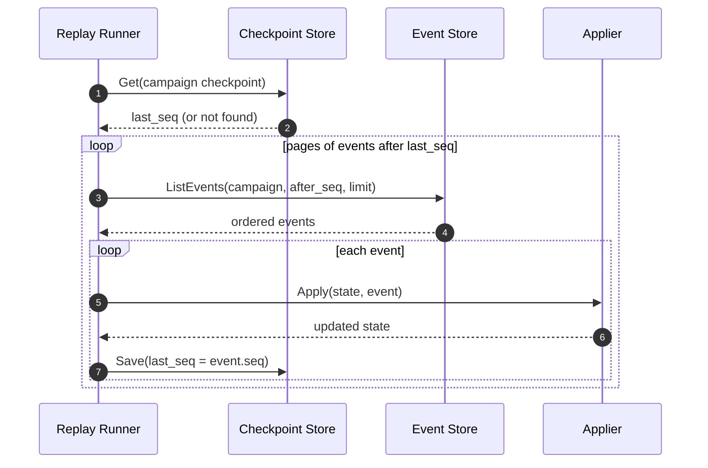

# Event Replay and Snapshots

This guide explains how the event journal, projections, and snapshots work
together, and how to replay events to rebuild derived state.

For command/event registration, envelope fields, and write-path routing, read
[Event-driven system](event-driven-system.md) first.

## Concepts

- **Event journal**: the append-only source of truth for a campaign.
- **Projection**: a derived view built by applying events in order.
- **Checkpoint**: a replay cursor (`last_seq`) that records how far replay has
  successfully applied events for a campaign.
- **Snapshot**: materialized derived state captured at a specific sequence to
  reduce replay cost. Snapshots are not authoritative.

## Invariant

- **Events-only writes**: services must not write to projection stores directly.
- **Emitter/applier split**: emitters append to `game-events`; appliers/adapters are the only writers to `game-projections`.

Snapshots never replace the event journal; they only accelerate rebuilds.

## Domain replay runner

The domain replay runner is a deterministic, checkpointed apply loop used by the
event-sourced core. It enforces ordered sequences, applies events in order, and
persists a per-campaign checkpoint after each successful apply.



Behavior:

- Replay starts from the max of the stored checkpoint and `after_seq`.
- Each applied event advances the checkpoint (`last_seq`) to guarantee idempotence
  if replay is restarted.
- Sequence gaps (non-contiguous `seq`) are treated as replay errors.
- System-owned events that cannot be routed to a registered module/projector are
  replay errors (fail-fast).
- Appliers must be deterministic and side-effect free beyond projection updates.

## Command replay state loading

The game domain engine uses checkpoint + snapshot seeding for command-time state
loading:

- `engine.ReplayStateLoader` first attempts to load snapshot state + sequence for
  the campaign.
- Replay then starts at the max of snapshot sequence, checkpoint sequence, and
  requested `after_seq`.
- `engine.Handler.Execute` persists checkpoint progress and snapshot state from
  the same write path so load/save sources stay aligned.

Current default wiring in the game server uses `checkpoint.NewMemory()` as a
process-local store for both checkpoints and command replay snapshots. After a
process restart, replay falls back to rebuilding from the event journal.

## Event integrity and tamper resistance

Events are the authority. To detect tampering (including manual database edits),
the event journal uses a hash chain plus HMAC signatures.

### Hash chain

- Each event stores `prev_event_hash` and `chain_hash`.
- `chain_hash` is SHA-256 over a canonical serialization of the event metadata,
  payload, and `prev_event_hash`.
- Any modification, deletion, or reordering breaks the chain.

### HMAC signature

- Each event stores `event_signature` and `signature_key_id`.
- `event_signature` is HMAC-SHA256 over the event `chain_hash`.
- HMAC prevents an attacker with direct DB access from recomputing the chain
  without the secret.

### Key strategy

- A single root secret is provided at runtime (never stored in the DB).
- A per-campaign signing key is derived from the root secret using HKDF with
  the campaign id as the context string (e.g., `campaign:<id>`).
- `signature_key_id` allows rotation and multi-key validation.

### Verification behavior

- Startup and replay must verify the hash chain and HMAC signatures.
- On failure, the default behavior is to fail startup to avoid serving
  potentially corrupted data.
- A read-only quarantine mode may be used for incident response, but must be
  explicitly enabled and should display integrity warnings.

### Rebuild implications

- Projections can always be rebuilt from events.
- Integrity failures cannot be repaired by replay; the events are untrusted.
- The maintenance CLI should report signature failures distinctly from
  projection mismatches.

### Storage boundaries

- Events live in a dedicated events database with append-only writes.
- Projections live in a separate database and are rebuilt from the journal.
- The projector is the only writer for projections; all other paths are read-only.

## Replay modes

### Full replay

Rebuild projections from the beginning of the campaign journal. Use this after
schema or projection changes to re-derive state from first principles.

### Snapshot-accelerated replay

Start from the latest snapshot and apply events after the snapshot sequence.
This is the default for most recovery and rebuild workflows.

### Partial replay

Replay a bounded window of events (after-seq / until-seq). This is useful for
targeted checks or backfills without reprocessing the full history.

## What snapshots contain

Two snapshot classes are used:

- Projection snapshots: system projection state for faster rebuild/recovery.
- Command replay snapshots: aggregate command state used to avoid replaying from
  sequence zero on every command execution.

Snapshots do not replace the event journal and should not be treated as
authoritative business history.

## Admin CLI workflows

The maintenance CLI can scan, validate, replay, or check integrity for a campaign.

```bash
# Scan snapshot-related events without applying projections
cmd/maintenance -campaign-id camp_123 -dry-run

# Validate snapshot event payloads
cmd/maintenance -campaign-id camp_123 -validate

# Replay snapshot-related events and apply projections
cmd/maintenance -campaign-id camp_123

# Integrity check (replay into scratch store and compare)
cmd/maintenance -campaign-id camp_123 -integrity

# Batch and JSON output
cmd/maintenance -campaign-ids camp_123,camp_456 -validate -json
```

Warnings are capped by default (`-warnings-cap 25`). Set `-warnings-cap 0` to
disable the cap.

## Operational notes

- Event order is authoritative; projections assume sequential application.
- Validation can fail if payloads are malformed or out of bounds.
- Integrity checks compare stored projections against a clean replay and exit
  non-zero on mismatches.
- Domain replay checkpoints advance after every applied event to avoid duplicates.

## Best practices

- Run `-integrity` after migrations or bulk backfills.
- Use `-validate` before replaying in production to surface invalid events.
- Prefer snapshot-accelerated replay for routine rebuilds.
