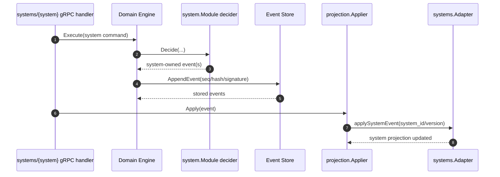

# Game Systems Architecture

This document explains how a game system extends the shared event-driven core.
For the command-to-event-to-projection lifecycle, read
[Event-driven system](event-driven-system.md) first.
For the high-level design checklist, see [systems checklist](systems.md).

## Design goals

Fracturing.Space keeps core campaign/session behavior system-agnostic while
allowing each ruleset to own its mechanics.

Benefits:

1. Shared infrastructure for campaigns, participants, sessions, and event
   journaling.
2. System-specific mechanics without polluting core domain packages.
3. Predictable replay and projection behavior across all systems.
4. Independent evolution of systems by version (`system_id + system_version`).

## Ownership boundaries

System support is built on ownership rules:

- Core-owned commands/events: campaign/session/participant/invite/character
  lifecycle.
- System-owned commands/events: mechanics and state transitions specific to a
  game system.

Invariants:

- Core must not emit system-owned events.
- Systems must not emit core-owned events.
- System-owned envelopes must include both `system_id` and `system_version`.
- Core treats system payloads as opaque and routes them to system handlers.

## Runtime extension surfaces

There are two extension surfaces with different responsibilities.

### Domain module registry (write-path routing)

Location: `internal/services/game/domain/system/registry.go`

Used by the domain engine to:

- register system-owned command and event definitions
- route system commands to module deciders
- route system events to module projectors during replay/fold

Module interface:

```go
type Module interface {
    ID() string
    Version() string
    RegisterCommands(registry *command.Registry) error
    RegisterEvents(registry *event.Registry) error
    Decider() Decider
    Projector() Projector
    StateFactory() StateFactory
}
```

### System bridge and projection adapters

Locations:

- `internal/services/game/domain/systems/registry_bridge.go`
- `internal/services/game/domain/systems/adapter_registry.go`

Used for:

- exposing game-system metadata through API surfaces
- applying system-owned events into system-specific projection tables

Projection adapter interface:

```go
type Adapter interface {
    ID() commonv1.GameSystem
    Version() string
    Apply(context.Context, event.Event) error
    Snapshot(context.Context, string) (any, error)
}
```

## Where systems plug in

Core registration entrypoint:

- `internal/services/game/domain/engine/registries.go`

Server wiring entrypoints:

- domain module registration: `internal/services/game/app/domain.go`
- projection adapter registration: `internal/services/game/api/grpc/game/system_adapters.go`

## Adding a new system (current flow)

### 1. Add identity and versioning

- Add enum values in `api/proto/common/v1/game_system.proto`.
- Run `make proto`.
- Define stable `SystemID` and `SystemVersion` constants in your module package.

### 2. Implement a domain module

Create `internal/services/game/domain/systems/{system}/module.go` that
implements `system.Module`.

Responsibilities:

- register system-owned command definitions
- register system-owned event definitions
- provide decider/projector/state-factory implementations

### 3. Define payload contracts and validation

- Add payload structs for command/event types.
- Validate payload shape and invariants in registry validators.
- Keep validation deterministic and replay-safe.

### 4. Wire into engine startup

Pass your module to `engine.BuildRegistries(...)` in
`internal/services/game/app/domain.go`.

### 5. Implement system projection adapter

Create `internal/services/game/domain/systems/{system}/adapter.go` implementing
`systems.Adapter`, then register it in
`internal/services/game/api/grpc/game/system_adapters.go`.

### 6. Add storage schema and queries

- Add migrations in `internal/services/game/storage/sqlite/migrations/`.
- Add query definitions in `internal/services/game/storage/sqlite/queries/`.
- Extend storage interfaces and conversion helpers.

### 7. Add transport/API handlers

- gRPC endpoints: `internal/services/game/api/grpc/systems/{system}/`.
- MCP mappings (if needed): `internal/services/mcp/`.

### 8. Verify through tests

- Unit tests for decider/projector/validators.
- Projection tests for adapter/store behavior.
- Integration tests across gRPC/MCP + storage.

### 9. Confirm system extension contract (required in reviews)

- All emitted system events are registered with explicit intent (`projection_and_replay`
  vs `audit_only`) so projection obligations are discoverable from registries.
- Core decider outputs have a test that new events can be round-tripped through
  `BuildRegistries` and replayed once in projector tests.
- Core applier and adapter coverage tests prove every `projection_and_replay` event
  is handled (or intentionally ignored by intent).
- Command builders and payload validators reject malformed envelopes with clear
  errors.
- New system event types are documented in both:
  - command/event runtime registrations
  - generated event catalogs generated from runtime registries.
- New code path is exercised with at least one happy-path and one rejection/edge-case
  test for each new command and event pairing.

This checklist should be part of review for each new game-system module.

### Runtime execution diagram



## Daggerheart reference implementation

Use Daggerheart as the baseline for structure and naming.

| Concern | Location |
|---|---|
| Module wiring | `internal/services/game/domain/systems/daggerheart/module.go` |
| Command decisions | `internal/services/game/domain/systems/daggerheart/decider.go` |
| Replay projector | `internal/services/game/domain/systems/daggerheart/projector.go` |
| Projection adapter | `internal/services/game/domain/systems/daggerheart/adapter.go` |
| Event type constants | `internal/services/game/domain/systems/daggerheart/event_types.go` |
| Payload contracts | `internal/services/game/domain/systems/daggerheart/payload.go` |
| gRPC system handlers | `internal/services/game/api/grpc/systems/daggerheart/` |

## Consistency expectations for system authors

1. Module deciders and projectors must be deterministic.
2. System events must be replay-safe and self-describing through payload + metadata.
3. Projection adapter behavior must be idempotent under replay.
4. Domain writes must happen through commands/events only, never direct projection mutation.

## Common failure modes

1. Missing `system_id/system_version` on system-owned envelopes:
   - command/event registry validation rejects writes.
2. Registering command types without event types (or vice versa):
   - runtime route failures or replay failures.
3. Forgetting projection adapter registration:
   - events append, but system projection state does not update.
4. Non-deterministic decider/projector code:
   - replay divergence and integrity incidents.

## Related docs

- Event lifecycle and consistency model: [Event-driven system](event-driven-system.md)
- Replay/checkpoint operations: [Event replay](event-replay.md)
- High-level system design checklist: [Systems checklist](systems.md)
