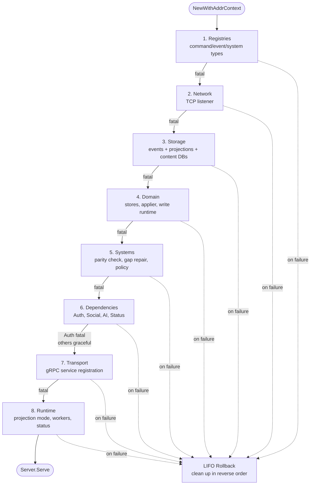

# Game Server Startup Phases

The game server starts through a sequence of validated phases. Each phase
registers rollback handlers so failures at any point clean up earlier
resources in reverse order.

Entry point: `app.NewWithAddrContext()` in `internal/services/game/app/bootstrap.go`.
The top-level bootstrap now sequences phase helpers; phase-local work lives in
`bootstrap_sequence.go` and sibling `bootstrap_*.go` collaborators.

## Phase overview

| # | Phase | File | Failure behavior |
|---|-------|------|-----------------|
| 1 | Registries | `bootstrap.go` | Fatal — command/event types misconfigured |
| 2 | Network | `bootstrap.go` | Fatal — port unavailable |
| 3 | Storage | `server_bootstrap.go` | Fatal — database open/migration failure |
| 4 | Domain | `bootstrap.go` | Fatal — store wiring or applier validation failure |
| 5 | Systems | `bootstrap.go`, `system_registration.go` | Fatal — module/adapter/metadata parity violation |
| 6 | Dependencies | `server_bootstrap.go` | Auth fatal; Social/AI/Status graceful |
| 7 | Transport | `bootstrap_service_registration.go` | Fatal — gRPC service registration failure |
| 8 | Runtime | `bootstrap.go` | Fatal — projection mode or worker configuration error |

## Phase details

### 1. Registries

`engine.BuildRegistries(registeredSystemModules()...)`

Initializes command, event, and system registries from declared game system
modules. `registeredSystemModules()` is manifest-derived, so built-in system
registration enters startup through the same `SystemDescriptor` list that also
feeds metadata and adapters. The phase validates that command types map to
handlers and event types map to fold functions. Output drives all downstream
wiring.

### 2. Network

`net.Listen("tcp", addr)`

Opens the gRPC listener. Registered for rollback cleanup. The listener stays
open until the serve loop starts.

### 3. Storage

`openStorageBundle()` in `server_bootstrap.go`

Opens three SQLite databases:
- **Events** (`FRACTURING_SPACE_GAME_EVENTS_DB_PATH`) — event journal with
  integrity keyring and chain verification
- **Projections** (`FRACTURING_SPACE_GAME_PROJECTIONS_DB_PATH`) — materialized
  read models
- **Content** (`FRACTURING_SPACE_GAME_CONTENT_DB_PATH`) — Daggerheart content
  metadata

Each database runs migrations on open and is registered for rollback cleanup.

### 4. Domain

Builds the root transport concern groups and the explicit projection `Applier`
as separate collaborators:
1. Create `WriteRuntime` for in-flight write tracking
2. Build root projection, infrastructure, content, and runtime concerns from
   the core projection database plus the explicit built-in system store bundle
   bound from that backend
3. Attach event registry
4. Configure domain execution layer
   Domain bootstrap mutates only the infrastructure/runtime concern groups:
   the event journal feeds engine construction and the runtime write path gets
   the executor.
5. Validate all service stores are wired
6. Build and validate the root `projection.Applier` from explicit applier deps
   Root store and applier construction now flow through exact app-owned source
   structs in dedicated phase-4 helper builders rather than inline config
   literals inside `configureStoresAndApplier`. Startup now calls the
   projection-owned applier constructor directly instead of rebuilding that
   projection surface in the root gRPC package. Startup also binds an explicit
   audit policy for the applier instead of relying on nil-store no-op
   inference. The phase returns a narrowed domain state of concern groups plus
   applier instead of carrying a root omnibus container forward into later
   startup phases.

### 5. Systems

Three substeps:
1. **System metadata registry** — loads game system metadata (Daggerheart)
2. **Parity validation** — ensures module registries, adapter registries, and
   metadata registries all agree on the systems declared in the manifest
3. **Projection gap repair** — detects campaigns with stale projections and
   replays missing events
4. **Session lock policy validation** — ensures transport interceptor and domain
   policy agree on blocked commands

### 6. Dependencies

Connects to external microservices:
- **Auth** (required) — `FRACTURING_SPACE_AUTH_ADDR`
- **Social** (graceful) — `FRACTURING_SPACE_SOCIAL_ADDR` — logs warning if
  unavailable
- **AI** (graceful) — `FRACTURING_SPACE_AI_ADDR` — logs warning if unavailable
- **Status** (advisory) — `FRACTURING_SPACE_STATUS_ADDR` — accumulates locally
  if unavailable
- **AI session grant config** — loaded from environment

After dialing, startup attaches only the social client into the root
`ContentStores` concern group; the dependency phase no longer mutates a broad
root service container.

### 7. Transport

`registerServices()` in `bootstrap_service_registration.go`

Builds and mounts gRPC service descriptors:
- 3 Daggerheart services (core, content, assets)
- 13 game core services (Campaign, Participant, Character, Session, etc.)
- Health service with per-service status

The root registration file now delegates constructor wiring to capability-local
helpers in `bootstrap_service_builders.go` so campaign, session, Daggerheart,
and infrastructure service families stay readable and reviewable in isolation.
Startup now assembles explicit Daggerheart, campaign, session, and
infrastructure registration deps directly before transport bootstrap from the
root projection, infrastructure, content, runtime, and system concern groups.
No transport-wide registration bundle remains between startup and service
registration, and the campaign/session family builders now consume exact
app-owned source structs rather than the full root store container or
concern-group bundles. Infrastructure and Daggerheart registration now follow
the same exact-source pattern, and the top-level bootstrap delegates the
remaining registration source fan-out to a dedicated startup-owned assembly
helper with one exact startup-owned source input.

### 8. Runtime

Configures background workers and status reporting:
- **Projection apply mode** — resolves one of `inline_apply_only`,
  `outbox_apply_only`, or `shadow_only`
- **Runtime store seam** — projection runtime policy mutates only the root
  `RuntimeStores` concern group rather than a broad root service container
- **Outbox worker** — processes queued projection events and owns
  per-campaign projection scheduling when apply mode is enabled
- **Status reporter** — heartbeat and catalog availability monitoring

## Serve loop

After bootstrap, `Server.Serve(ctx)` starts:
1. Background workers (projection, status, catalog monitor)
2. gRPC server on the listener
3. Shutdown on context cancellation — workers stop, gRPC graceful stop,
   resources closed

## Rollback on failure

All phases register cleanup in a LIFO stack:
1. Listener close
2. Storage bundle close
3. Auth connection close
4. Social connection close
5. AI connection close
6. Status connection close

On error in any phase, cleanup runs in reverse order.
